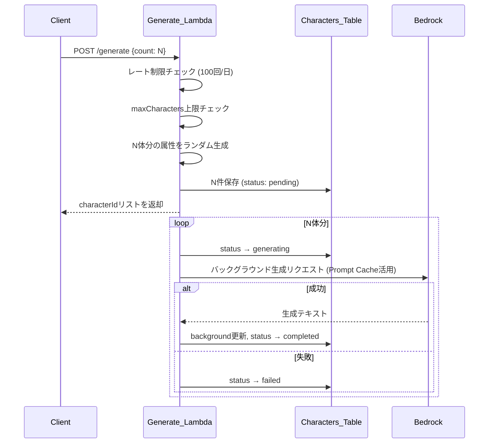
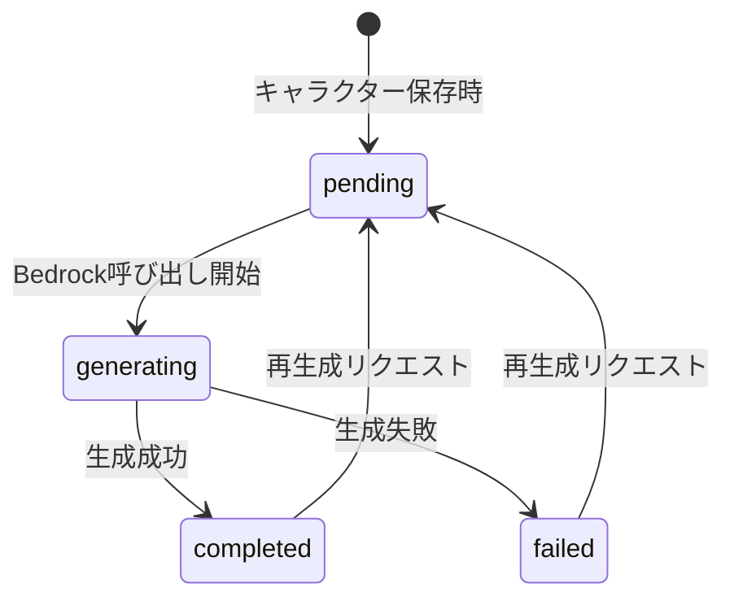

# デザインドキュメント: character-generator

## Overview

character-generatorは、ゲームデザイナーがゲームキャラクターの設定を効率的に作成・管理するためのWebアプリケーションである。ユーザーはプロジェクト単位で世界観を定義し、その世界観に基づいてキャラクターをランダム生成できる。各キャラクターにはAmazon Bedrockが日本語のバックグラウンドストーリーを自動生成する。

主な機能:
- Cognitoによるユーザー認証
- プロジェクトのCRUD管理
- キャラクターのランダム属性生成
- Bedrockによるバックグラウンドストーリー自動生成・再生成
- キャラクター間の関係性管理とネットワークグラフ可視化
- ポーリングによるリアルタイム生成状態同期

技術スタック:
- フロントエンド: React + TypeScript (AWS Amplify Gen2)
- バックエンド: API Gateway + Lambda (Node.js 24/TypeScript)
- データストア: Amazon DynamoDB (CDK で直接定義、PK/SK 複合キー設計)
- AI生成: Amazon Bedrock (Claude Haiku 4.5)
- 認証: Amazon Cognito

---

## Architecture

```mermaid
graph TB
    subgraph Frontend["Frontend (Amplify Hosting)"]
        UI[React + TypeScript App]
        Auth[Amplify Authenticator\n(Google Login)]
    end

    subgraph API["API Layer"]
        APIGW[API Gateway REST API]
    end

    subgraph Lambda["Lambda Functions"]
        PL[Project_Lambda]
        CL[Character_Lambda]
        RL[Relationship_Lambda]
        GL[Generate_Lambda]
    end

    subgraph Storage["Data Layer"]
        PT[(Projects_Table)]
        CT[(Characters_Table)]
        RT[(Relationships_Table)]
    end

    subgraph AI["AI Layer"]
        BR[Amazon Bedrock\nClaude Haiku 4.5]
    end

    Cognito[Amazon Cognito\n+ Google OAuth]

    UI --> Auth
    Auth --> Cognito
    UI --> APIGW
    APIGW --> Cognito
    APIGW --> PL
    APIGW --> CL
    APIGW --> RL
    APIGW --> GL
    PL --> PT
    CL --> CT
    RL --> RT
    GL --> CT
    GL --> BR
    CL --> BR
```

### デプロイ戦略

| ブランチ | 環境 |
|---|---|
| main | Production |
| develop | Development |
| feature/* | Sandbox |

---

## Components and Interfaces

### REST API エンドポイント

詳細なリクエスト/レスポンス仕様は [`docs/openapi.yaml`](../../docs/openapi.yaml) を参照。

| Method | Path | Lambda | 説明 |
|---|---|---|---|
| POST | /projects | Project_Lambda | プロジェクト作成 |
| GET | /projects | Project_Lambda | プロジェクト一覧取得 |
| GET | /projects/{projectId} | Project_Lambda | プロジェクト詳細取得 |
| PUT | /projects/{projectId} | Project_Lambda | プロジェクト更新（worldSetting） |
| DELETE | /projects/{projectId} | Project_Lambda | プロジェクト削除 |
| POST | /projects/{projectId}/characters/generate | Generate_Lambda | キャラクター一括生成 |
| GET | /projects/{projectId}/characters | Character_Lambda | キャラクター一覧取得 |
| GET | /projects/{projectId}/characters/{characterId} | Character_Lambda | キャラクター詳細取得 |
| PUT | /projects/{projectId}/characters/{characterId} | Character_Lambda | キャラクター更新 |
| DELETE | /projects/{projectId}/characters/{characterId} | Character_Lambda | キャラクター削除 |
| POST | /projects/{projectId}/characters/{characterId}/regenerate | Character_Lambda | バックグラウンド再生成 |
| POST | /projects/{projectId}/relationships | Relationship_Lambda | 関係性作成 |
| GET | /projects/{projectId}/relationships | Relationship_Lambda | 関係性一覧取得 |
| DELETE | /projects/{projectId}/relationships/{relationshipId} | Relationship_Lambda | 関係性削除 |

### 認証フロー

すべてのAPIリクエストはCognitoが発行したJWTトークンをAuthorizationヘッダーに含める必要がある。API GatewayはCognito Authorizerでトークンを検証し、未認証リクエストには401を返す。

ユーザーはGoogleアカウントでログインする。CognitoはGoogleのOAuthフェデレーションを通じてトークンを発行する。パスワード管理は不要。

**セットアップ手順（初回のみ）:**
1. Google Cloud ConsoleでOAuthクライアントIDを作成
2. 承認済みリダイレクトURIにCognitoのホストされたUIのURLを追加
3. `GOOGLE_CLIENT_ID` と `GOOGLE_CLIENT_SECRET` を環境変数に設定

### Generate_Lambda 処理フロー



### フロントエンドコンポーネント構成

```
src/
├── pages/
│   ├── Dashboard.tsx          # プロジェクト一覧
│   ├── ProjectDetail.tsx      # プロジェクト詳細 + キャラクター一覧
│   ├── CharacterDetail.tsx    # キャラクター詳細・編集
│   └── RelationshipMap.tsx    # 関係性ネットワークグラフ
├── components/
│   ├── Combobox.tsx           # 選択肢 + 自由入力コンポーネント
│   └── CharacterCard.tsx      # キャラクターカード表示
└── hooks/
    └── usePolling.ts          # ポーリングカスタムフック
```

### Combobox コンポーネントインターフェース

```typescript
interface ComboboxProps {
  options: string[];
  value: string;
  onChange: (value: string) => void;
  placeholder?: string;
}
```

---

## Data Models

### Projects_Table

| 属性 | 型 | 説明 |
|---|---|---|
| PK | String | `userId` |
| SK | String | `project#{projectId}` |
| projectId | String | ULID |
| projectName | String | プロジェクト名 |
| worldSetting | String | 世界観説明テキスト |
| maxCharacters | Number | 最大キャラクター数 |
| createdAt | String | ISO8601形式 |
| updatedAt | String | ISO8601形式 |

### Characters_Table

| 属性 | 型 | 説明 |
|---|---|---|
| PK | String | `project#{projectId}` |
| SK | String | `character#{characterId}` |
| characterId | String | ULID |
| gender | String | 性別 |
| personality | String | 性格 |
| age | String | 年代 |
| species | String | 種族 |
| occupation | String | 職業 |
| hairColor | String | 髪色 |
| skinColor | String | 肌色 |
| specialNotes | String | 特記事項（最大200文字） |
| background | String | バックグラウンドストーリー |
| generationStatus | String | pending / generating / completed / failed |
| createdAt | String | ISO8601形式 |
| updatedAt | String | ISO8601形式 |

GSI1: `PK: project#{projectId}, SK: createdAt` (キャラクター一覧の昇順取得用)

### Relationships_Table

| 属性 | 型 | 説明 |
|---|---|---|
| PK | String | `project#{projectId}#character#{characterIdA}` |
| SK | String | `relation#{characterIdB}` |
| relationshipId | String | ULID |
| relationshipType | String | 仲間 / ライバル / 師弟 / 恋人 / 家族 / 敵対 |
| description | String | 関係性の説明 |

関係性はA→BとB→Aの2レコードを対称的に保存する。

### generationStatus 状態遷移



### ランダム生成属性の選択肢

```typescript
const ATTRIBUTE_OPTIONS = {
  gender: ["男性", "女性", "その他"],
  personality: ["冷静沈着", "熱血漢", "臆病", "好奇心旺盛", "慎重", "楽天的", "皮肉屋", "優しい", "厳格", "自由奔放"],
  age: ["10代", "20代", "30代", "40代", "50代", "60代", "70代", "80代"],
  species: ["人間", "エルフ", "ドワーフ", "獣人", "竜人", "半霊", "機械人形"],
  occupation: ["剣士", "魔法使い", "弓使い", "盗賊", "僧侶", "商人", "鍛冶師", "学者", "吟遊詩人", "農民", "貴族", "傭兵"],
  hairColor: ["黒", "白", "金", "銀", "赤", "青", "緑", "茶", "紫"],
  skinColor: ["色白", "小麦色", "褐色", "灰色", "青白い", "緑がかった"],
};
```

---

## Correctness Properties

*A property is a characteristic or behavior that should hold true across all valid executions of a system — essentially, a formal statement about what the system should do. Properties serve as the bridge between human-readable specifications and machine-verifiable correctness guarantees.*

### Property 1: 未認証リクエストは拒否される

*For any* APIエンドポイントに対して、Authorizationヘッダーなしで送信されたリクエストは、HTTPステータス401を返す

**Validates: Requirements 1.2**

### Property 2: プロジェクト作成のラウンドトリップ

*For any* 有効なprojectNameとworldSettingの組み合わせに対して、POST /projects でプロジェクトを作成した後、GET /projects/{projectId} で取得すると、作成時と同じprojectName・worldSetting・必須属性（projectId、createdAt、updatedAt）がすべて含まれる

**Validates: Requirements 2.1, 2.3, 2.7**

### Property 3: プロジェクト一覧は降順で返される

*For any* ユーザーが持つプロジェクト群に対して、GET /projects で取得した一覧はcreatedAtの降順に並んでいる

**Validates: Requirements 2.2**

### Property 4: 他ユーザーのプロジェクトへのアクセスは拒否される

*For any* 2人の異なるユーザーに対して、ユーザーAが作成したプロジェクトにユーザーBがアクセスすると、HTTPステータス403が返る

**Validates: Requirements 2.4**

### Property 5: プロジェクト削除のラウンドトリップ

*For any* 存在するプロジェクトに対して、DELETE /projects/{projectId} で削除した後、GET /projects/{projectId} でアクセスすると404が返る

**Validates: Requirements 2.5**

### Property 6: キャラクター生成数の一致

*For any* 有効なcount値N（1以上、maxCharacters未満）に対して、POST /generate に {"count": N} を送信すると、レスポンスのcharacterIdリストの長さはNであり、Characters_Tableに保存されたキャラクター数もNである

**Validates: Requirements 3.1, 3.2**

### Property 7: 生成されたキャラクター属性は定義済み選択肢内に収まる

*For any* 生成されたキャラクターに対して、gender・personality・age・species・occupation・hairColor・skinColorの各属性値は、それぞれの定義済み選択肢リストに含まれており、specialNotesは空文字列で初期化されている

**Validates: Requirements 3.3, 3.6**

### Property 8: maxCharacters超過時は400を返す

*For any* プロジェクトで、キャラクター数がmaxCharactersに達している状態で追加生成リクエストを送ると、HTTPステータス400が返る

**Validates: Requirements 3.4, 11.3**

### Property 9: バックグラウンドストーリー生成完了後の状態

*For any* 生成リクエストに対して、Bedrockによるバックグラウンドストーリー生成が成功した後、対象キャラクターのbackgroundフィールドは空でなく、generationStatusはcompletedになっている

**Validates: Requirements 4.1, 4.5, 4.6**

### Property 10: バックグラウンドストーリー再生成のラウンドトリップ

*For any* completedまたはfailed状態のキャラクターに対して、POST /regenerate を実行して成功すると、backgroundフィールドが更新され、generationStatusがcompletedになっている

**Validates: Requirements 5.1, 5.2**

### Property 11: キャラクター一覧は昇順で返される

*For any* プロジェクト内のキャラクター群に対して、GET /characters で取得した一覧はcreatedAtの昇順に並んでいる

**Validates: Requirements 6.1**

### Property 12: キャラクター更新のラウンドトリップ

*For any* 存在するキャラクターと任意の更新データに対して、PUT /characters/{characterId} で更新した後、GET /characters/{characterId} で取得すると、更新した属性値が反映されている

**Validates: Requirements 6.2, 6.3**

### Property 13: キャラクター削除のラウンドトリップ

*For any* 存在するキャラクターに対して、DELETE /characters/{characterId} で削除した後、GET /characters/{characterId} でアクセスすると404が返る

**Validates: Requirements 6.4**

### Property 14: 関係性は双方向に保存される

*For any* 2つのキャラクターA・Bと任意のrelationshipTypeに対して、POST /relationships でA-B間の関係性を作成すると、GET /relationships の結果にA→BとB→Aの両方のレコードが含まれる

**Validates: Requirements 7.1, 7.2**

### Property 15: 関係性削除は双方向に削除される

*For any* 存在する関係性に対して、DELETE /relationships/{relationshipId} で削除すると、GET /relationships の結果からA→BとB→Aの両方のレコードが消える

**Validates: Requirements 7.3**

### Property 16: generationStatusに応じたUI表示

*For any* キャラクターのgenerationStatusに対して、pending/generatingのときはローディング表示が行われ、failedのときはエラー状態と再生成ボタンが表示される

**Validates: Requirements 8.5, 8.6**

### Property 17: Comboboxのフィルタリング

*For any* 選択肢リストと任意の入力文字列に対して、Comboboxのフィルタリング結果はすべて入力文字列を含む選択肢のみである

**Validates: Requirements 9.2, 9.4**

### Property 18: Comboboxはカスタム値を受け入れる

*For any* 選択肢リストに含まれない任意の文字列を入力したとき、Comboboxはその値をonChangeで返す

**Validates: Requirements 9.3**

### Property 19: ポーリングは完了時に停止する

*For any* キャラクター生成後のポーリング状態において、プロジェクト内の全キャラクターのgenerationStatusがcompletedまたはfailedになったとき、ポーリングが停止する

**Validates: Requirements 10.1, 10.2**

---

## Error Handling

### APIエラーレスポンス形式

すべてのエラーレスポンスは以下の形式で返す:

```json
{
  "error": {
    "code": "ERROR_CODE",
    "message": "エラーの説明"
  }
}
```

### エラーコード一覧

| HTTPステータス | コード | 発生条件 |
|---|---|---|
| 400 | MAX_CHARACTERS_EXCEEDED | プロジェクトのキャラクター数がmaxCharactersに達している |
| 400 | INVALID_REQUEST | リクエストボディのバリデーションエラー |
| 401 | UNAUTHORIZED | 認証トークンなし・無効 |
| 403 | FORBIDDEN | 他ユーザーのリソースへのアクセス |
| 404 | NOT_FOUND | 指定リソースが存在しない |
| 429 | RATE_LIMIT_EXCEEDED | 1日の生成回数上限（100回）超過 |
| 500 | INTERNAL_ERROR | Lambda内部エラー |
| 503 | BEDROCK_UNAVAILABLE | Bedrock呼び出し失敗 |

### Bedrock障害時の挙動

Bedrock呼び出しが失敗した場合、generationStatusをfailedに更新してエラーを記録する。キャラクターの基本属性は保持され、ユーザーは再生成ボタンから再試行できる。

### レート制限の実装

1日の生成回数カウントはDynamoDBに `PK: rateLimit#{userId}, SK: date#{YYYY-MM-DD}` の形式で保存し、TTLを翌日0時に設定する。

---

## インフラ構成

### DynamoDB テーブル定義

DynamoDB テーブルは Amplify Gen2 の `defineData` (AppSync/GraphQL) を使用せず、CDK の `aws-cdk-lib/aws-dynamodb` で直接定義する。これにより Lambda の PK/SK 複合キー設計をそのまま使用できる。

```typescript
// amplify/backend.ts
const projectsTable = new dynamodb.Table(apiStack, "ProjectsTable", {
  tableName: "Projects_Table",
  partitionKey: { name: "PK", type: dynamodb.AttributeType.STRING },
  sortKey:      { name: "SK", type: dynamodb.AttributeType.STRING },
  billingMode:  dynamodb.BillingMode.PAY_PER_REQUEST,
  removalPolicy: cdk.RemovalPolicy.DESTROY,
});
```

同様に `Characters_Table`、`Relationships_Table` も定義する。

### テーブル名の環境変数

Lambda には以下の環境変数でテーブル名を渡す:

| 環境変数 | 値 |
|---|---|
| PROJECTS_TABLE_NAME | Projects_Table |
| CHARACTERS_TABLE_NAME | Characters_Table |
| RELATIONSHIPS_TABLE_NAME | Relationships_Table |

---

## Testing Strategy

### デュアルテストアプローチ

ユニットテストとプロパティベーステストを組み合わせて包括的なカバレッジを実現する。

**ユニットテスト** (Jest + ts-jest):
- 特定の入力・出力の例を検証
- エラーケースと境界値の確認
- コンポーネント間の統合ポイント
- Bedrockリクエストのパラメータ確認（モック使用）

**プロパティベーステスト** (fast-check):
- 普遍的なプロパティをランダム入力で検証
- 各プロパティテストは最低100イテレーション実行
- 各テストにはデザインドキュメントのプロパティ番号をタグとして付与

### プロパティテストのタグ形式

```typescript
// Feature: character-generator, Property 7: 生成されたキャラクター属性は定義済み選択肢内に収まる
fc.assert(
  fc.property(fc.integer({ min: 1, max: 10 }), (count) => {
    // ...
  }),
  { numRuns: 100 }
);
```

### テスト対象と担当テスト種別

| 対象 | ユニットテスト | プロパティテスト |
|---|---|---|
| Generate_Lambda (属性生成ロジック) | ✓ | ✓ (Property 6, 7, 8) |
| Project_Lambda (CRUD) | ✓ | ✓ (Property 2, 3, 4, 5) |
| Character_Lambda (CRUD) | ✓ | ✓ (Property 11, 12, 13) |
| Relationship_Lambda | ✓ | ✓ (Property 14, 15) |
| Bedrock_Client | ✓ (モック) | ✓ (Property 9, 10) |
| Comboboxコンポーネント | ✓ | ✓ (Property 17, 18) |
| usePollingフック | ✓ | ✓ (Property 19) |
| CharacterDetail UI状態 | ✓ | ✓ (Property 16) |

### ユニットテストの重点項目

- Bedrockリクエストのシステムプロンプト内容確認（Requirements 4.2）
- Bedrockリクエストのmax_tokens=500確認（Requirements 4.3）
- specialNotesの200文字制限バリデーション（Requirements 9.5）
- プレースホルダーテキストの表示確認（Requirements 9.6）
- Project_Detail_PageとCharacter_Detail_Pageのコンポーネント存在確認（Requirements 8.2, 8.3）

### テスト環境

- Lambda関数: Jest + ts-jest、DynamoDBはaws-sdk-client-mockでモック
- フロントエンド: Vitest + React Testing Library、APIはMSWでモック
- プロパティテスト: fast-check（フロントエンド・バックエンド共通）
